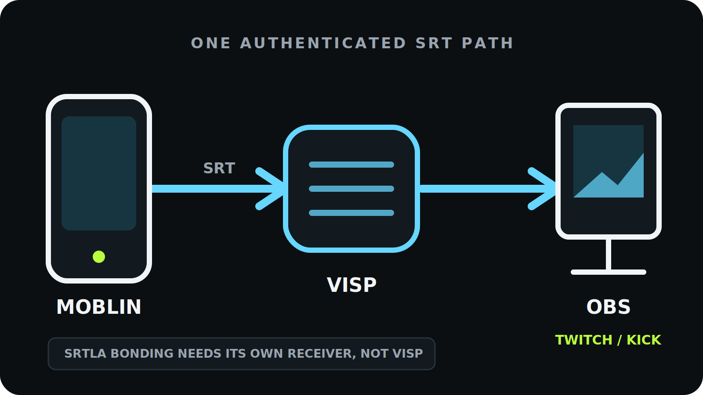

To use [Moblin](https://github.com/eerimoq/moblin) as a remote camera in OBS,
**create a video source in VISP, paste its SRT publishing URL into a Moblin
stream, and add the separate OBS reading URL as a Media Source.** Moblin handles
capture and mobile encoding on the iPhone, VISP authenticates and relays the
contribution feed, and OBS keeps control of the finished Twitch or Kick
broadcast.

Moblin is a free, open-source (MIT) iOS streaming app. It can publish over SRT,
so it fits the same relay pattern as any other encoder: the phone connects
outward to VISP, OBS connects outward to VISP, and the home network never needs
an inbound SRT port. The Twitch or Kick stream key stays in OBS, not on the
field phone.

## Why Moblin, and where its bonding actually lives

Moblin is worth singling out because it does more than plain SRT. Its README
lists support for "RTMP, RTMPS, SRT, SRTLA, RIST or WHIP (WebRTC)," plus
"Adaptive bitrate for SRT(LA)" and the ability to "use one cellular, one WiFi
and multiple Ethernet connections simultaneously. Often called bonding." That
last capability is **SRTLA**, and it is the part most likely to cause a wrong
assumption about this workflow.

SRTLA is a separate protocol layered on SRT. Per the
[BELABOX SRTLA project](https://github.com/BELABOX/srtla), it needs both a
sender and a matching receiver: `srtla_send` spreads one SRT stream across
several links, and `srtla_rec` reassembles them "back into a coherent SRT
stream" before handing it to a normal SRT application. In other words, bonding
only works if the far end is an SRTLA receiver.

VISP is **not** an SRTLA receiver. It is a self-hosted SRT/RTMP relay and
control plane, and it does not bond network connections. So when you point
Moblin at a VISP video source, you use Moblin's **plain SRT** output over a
single link — not SRTLA. If you genuinely need to bond cellular and Wi-Fi into
one resilient uplink, that belongs to Moblin's SRTLA path with a BELABOX-style
receiver, or to a dedicated bonded encoder, as covered in
[VISP vs BELABOX vs LiveU Solo](/blog/visp-vs-belabox-vs-liveu-solo). This
guide is about Moblin's single-path SRT contribution into an existing OBS
studio, which is the more common need.

## What you need

- Moblin installed on the field iPhone (App Store, free)
- OBS Studio on the production computer
- A VISP account signed in with Twitch or Kick
- Enough sustained upload capacity for Moblin and download capacity for OBS
- Headphones for checking audio without creating a return-path echo
- A local OBS fallback scene for a field interruption

Rehearse with the same phone, carrier, route, and time of day you expect to use
on the day. A fast Wi-Fi test at home does not validate a moving cellular
production, and Moblin's on-screen bitrate and connection statistics are only
meaningful on the real route.

## 1. Create a Moblin video source in VISP

Sign in to VISP, open **Video sources**, choose **Add device**, and give it a
practical name such as "roaming Moblin" or "handheld iPhone." One VISP device
represents one publishing path.

Choose **Copy** beside **Add this to video source**. The value begins with
`srt://` and includes the path's publishing credential. Treat the whole URL as a
password: do not paste it into screenshots, chat, stream overlays, or a public
troubleshooting post.

VISP shows SRT by default. Keep it unless the sending network blocks UDP. The
dashboard exposes an RTMP fallback in **Advanced** mode, but switching protocols
does not add bandwidth to a connection that simply lacks enough upload capacity.
For the exact dashboard flow, see the VISP documentation for
[adding a video source](https://docs.visp-stream.com/docs/video-source).

## 2. Add the SRT stream in Moblin

In Moblin, open **Settings → Streams → Create stream**, then set its **URL** to
the complete VISP publishing URL. Because the URL uses the `srt://` scheme,
Moblin sends over plain SRT rather than SRTLA — which is exactly what a VISP
video source expects. Select that stream as the active one before returning to
the camera view.

Paste the VISP URL as a single value. Do not try to split it into separate
server, stream ID, or password fields, and do not change the scheme to
`srtla://`. The generated URL already carries the SRT stream ID and
authentication data in the format the relay expects, and `srtla://` would ask
Moblin to reach a bonding receiver that VISP does not provide.

## 3. Choose settings the mobile connection can sustain

Use H.264 video and AAC audio for the predictable VISP-to-OBS path. Set a
two-second keyframe interval and pick a resolution and frame rate the phone can
hold steady. Lock the camera orientation before you compose the source in OBS;
switching from landscape to portrait later can break an existing crop or scene
layout.

Do not choose bitrate from a single speed-test peak. Measure the real route and
leave margin below the repeatable upload result. A stable 720p30 picture is more
useful than a nominal 1080p feed that constantly queues, freezes, or reconnects.

| Network behavior | Better first adjustment |
| --- | --- |
| Bitrate repeatedly approaches available upload | Lower target bitrate |
| Short bursts of loss or jitter | Increase SRT latency |
| Capacity changes while moving | Enable Moblin adaptive bitrate |
| Long dead zone or total carrier outage | Use OBS fallback or add real bonding |

Moblin's README explicitly lists "Adaptive bitrate for SRT(LA)," which lets the
encoder lower and later restore bitrate as mobile capacity changes. Test it at
the lowest picture quality you would accept before relying on it live. Adaptive
bitrate can trade detail for continuity; it cannot send video when the active
connection has no usable route.

VISP **does not transcode** the incoming feed. The codec, resolution, frame
rate, keyframe interval, and bitrate Moblin sends are what the relay passes
toward OBS. Fix an incompatible or oversized contribution at the encoder rather
than expecting the relay to convert it.

## 4. Tune SRT latency from the field network

SRT can retransmit missing UDP packets while they are still useful, and its
latency window is what gives those retransmissions time to arrive. Too small a
window shows visible loss; an unnecessarily large one adds delay to the
field-to-studio path. The
[SRT project](https://github.com/Haivision/srt) documents this automatic-repeat
behavior, and the [SRT Alliance overview](https://www.srtalliance.org/about-srt-technology/)
explains why latency is tied to round-trip time.

Run VISP's latency probe on the connection Moblin will actually use and select
the correct network profile. VISP turns the median of seven round-trip samples
into these starting recommendations:

| Profile | Recommendation | Minimum |
| --- | ---: | ---: |
| Wired | 3× measured RTT | 120 ms |
| Wi-Fi | 4× measured RTT | 300 ms |
| Cellular | 6× measured RTT | 600 ms |

Enter the recommended millisecond value in Moblin's SRT latency setting for that
stream. Cellular gets more headroom because its jitter is often bursty. Do not
shrink the value just to advertise a smaller delay; watch motion and recovery on
the real route first. The
[OBS SRT guide](https://obsproject.com/kb/srt-protocol-streaming-guide)
describes latency the same way, in microseconds on the URL; VISP applies more
conservative profile floors tuned for mobile contribution.

## 5. Bring the Moblin feed into OBS

Moblin uses the **publishing URL**. OBS must use the separate **reading URL**.
They are intentionally different credentials.

The quickest OBS setup is to pair the VISP plugin, select the Moblin device, and
add it to the current scene. The plugin creates the authenticated Media Source
without exposing a public control port, exactly as described in
[VISP OBS remote control](https://docs.visp-stream.com/docs/obs-remote-control).
Alternatively, download the generated scene collection and choose **Scene
Collection → Import**; it includes a Fallback scene and one reconnecting Media
Source scene per active VISP device.

For a manual source:

1. Reveal or copy the device's OBS reading URL in VISP.
2. In OBS, add a **Media Source**.
3. Clear **Local File**.
4. Paste the OBS reading URL into **Input**.
5. Set **Input Format** to `mpegts` if it is not already supplied.
6. Confirm the source reconnects after Moblin stops and starts again.

Rotating the account-wide OBS read credential invalidates every existing OBS
source for that account, so do it only when you intend to replace them. Rotating
one Moblin device's publish credential affects only that device. This is the
same source workflow used for the
[phone-as-an-OBS-camera guide](/blog/use-phone-as-remote-camera-obs) and the
[Larix Broadcaster setup](/blog/larix-broadcaster-obs-srt); Moblin simply
replaces the encoder on the phone.

## 6. Test recovery before the real broadcast

Start Moblin before you send OBS to Twitch or Kick. The matching VISP device
should change to **Live**, and the OBS source should begin moving once the SRT
connection and a decodable keyframe arrive.

Run this short failure drill with the destination still offline:

1. Confirm motion and audio in OBS for several minutes.
2. Disable the phone's active network.
3. Verify OBS stays connected and shows the local fallback scene.
4. Re-enable the phone network and watch Moblin reconnect.
5. Confirm the same OBS Media Source resumes without a new URL.
6. Wait for stable playback before cutting back to the field camera.

For a production that should keep entertaining viewers while the camera is
offline, follow the
[mobile-network resilience guide](/blog/keep-stream-live-bad-mobile-network)
and configure a Media-state condition in Advanced Scene Switcher so a brief
decoder change does not flap between scenes.

## What this setup does not do

VISP relays the authenticated feed; it does not transcode it and it does not
bond connections. SRT retransmission can recover some packet loss, but it cannot
combine two ISPs or keep sending through a total outage. If one carrier must
fail without interrupting the field picture, keep that resilience where it
belongs: Moblin's own SRTLA bonding with a BELABOX-style receiver, or a
dedicated bonded encoder. Pointing Moblin's plain SRT at VISP gives you one
authenticated link, not aggregation.

Only one publisher can own a VISP device path at a time. A second phone cannot
sit pre-connected on the same URL as a seamless standby. Give every phone or
encoder its own VISP device and OBS source; the
[multi-phone IRL guide](/blog/multi-phone-irl-stream-obs) shows how those
independent sources compose in OBS.

## Troubleshooting

### Moblin starts, but VISP never shows Live

Check that the correct stream is selected, the full current publishing URL was
pasted, and its scheme is `srt://` rather than `srtla://`. Confirm no other
encoder is already using that device path. If the credential was rotated or
revoked, replace the old Moblin URL.

### VISP is Live, but OBS is blank

Make sure OBS has the reading URL, not the Moblin publishing URL. Confirm the
Media Source has **Local File** disabled and wait for a keyframe. If the OBS read
credential was rotated, download a fresh scene collection or update the source
URL.

### The picture freezes while moving

Lower the target bitrate, enable and test Moblin's adaptive bitrate, and rerun
the VISP latency probe on the field connection. More latency helps recover
bursts of loss, but it cannot compensate for sustained upload below the encoded
bitrate.

### Video works, but OBS has no audio

Confirm Moblin has microphone permission and is sending an AAC track, then check
that the OBS Media Source is not muted and its monitoring does not create
feedback on the phone.

### SRT is blocked on the venue network

Switch VISP to **Advanced**, copy that device's RTMP publishing URL, and create
an RTMP stream in Moblin. Keep OBS on its generated reading path. RTMP is a
compatibility fallback over TCP, not a cure for insufficient bandwidth.

## Pre-stream checklist

- Moblin's active stream uses the current VISP `srt://` publishing URL.
- H.264, AAC, orientation, keyframe interval, and bitrate are tested.
- SRT latency comes from a probe on the real field network.
- Adaptive bitrate is enabled and tested when mobile capacity varies.
- OBS uses the separate reading URL and receives both picture and audio.
- The destination stream key remains only in OBS.
- A forced outage switches to fallback and the same source recovers.
- Every additional camera has its own VISP device and credentials.

## Frequently asked questions

### Does Moblin send directly to Twitch or Kick in this workflow?

No. Moblin sends a contribution feed to VISP, OBS receives it, and OBS sends the
finished production to Twitch or Kick. That keeps scenes, alerts, recording, and
the destination stream key at the studio.

### Can I use Moblin's SRTLA bonding through VISP?

No. SRTLA needs a matching SRTLA receiver to reassemble the bonded links, and
VISP is a plain SRT/RTMP relay, not that receiver. Use Moblin's `srt://` output
for VISP, and keep SRTLA bonding on its own BELABOX-style receiver if you need
it.

### Should I use SRT or RTMP from Moblin?

Use SRT by default for recovery on an unpredictable network. Use RTMP when the
sending network cannot pass UDP. Neither protocol creates bandwidth, transcodes
video, or bonds connections.

### Is Moblin required for VISP?

No. Moblin is a strong free option on iPhone, especially for creators who value
an open-source encoder. VISP's own native and browser publishers, and encoders
like Larix Broadcaster, cover the same relay path.

## Sources and next steps

- [Moblin open-source project (README and capabilities)](https://github.com/eerimoq/moblin)
- [BELABOX SRTLA bonding protocol](https://github.com/BELABOX/srtla)
- [VISP: add a video source](https://docs.visp-stream.com/docs/video-source)
- [VISP: OBS remote control and publishing devices](https://docs.visp-stream.com/docs/obs-remote-control)
- [VISP: encoders, SRT latency, and fallback](https://docs.visp-stream.com/docs/broadcaster-setup)
- [OBS SRT protocol streaming guide](https://obsproject.com/kb/srt-protocol-streaming-guide)
- [Haivision SRT open-source project](https://github.com/Haivision/srt)

If you already produce in OBS and want a free open-source phone encoder to
become a managed field camera, [try VISP](https://visp-stream.com): create one
device, paste its SRT URL into Moblin, and run the failure drill before your
next live show.
