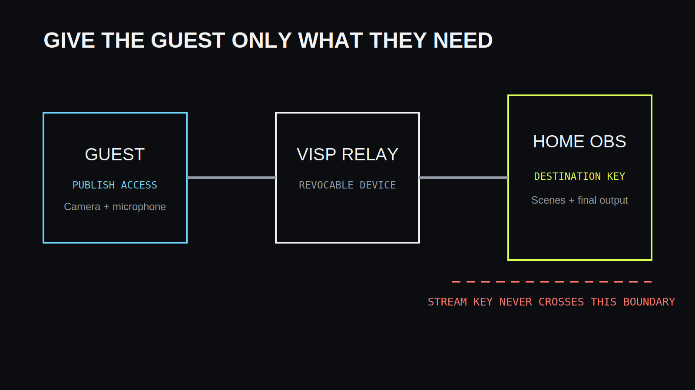
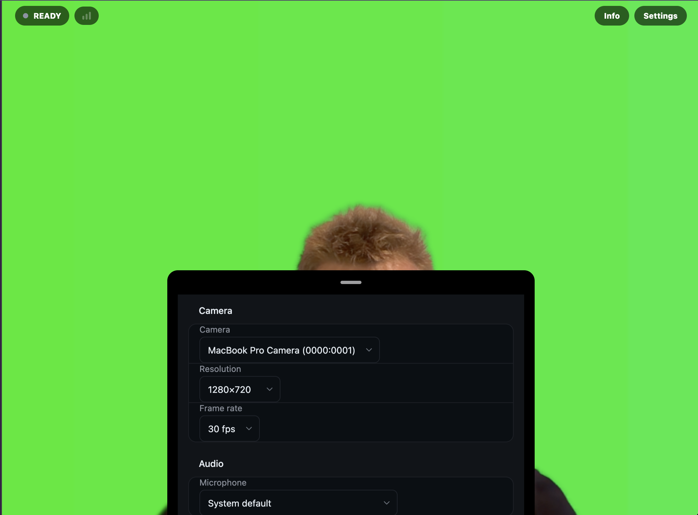

Etävieras tarvitsee oikeuden lähettää oma kameransa tuotantoosi, mutta ei
oikeutta Twitch- tai Kick-tiliisi. Luo vieraalle erillinen VISP-laite, anna
hänen julkaista siihen selaimella ja peruuta laitteen tunnus striimin jälkeen.

## Erota vieraan feedi striimin lähetyksestä

Vieraan selain lähettää kameran ja mikrofonin VISP-relaylle. OBS lukee suojatun
syötteen, yhdistää sen kohtauksiin ja striimaa valmiin videon Twitchiin, Kickiin, Youtubeen Tiktokkiin jnejnejne.
Vieraan ei tarvitse nähdä OBS:n tunnuksia, muita scenejä tai muita kameroita.

Tämä pienimmän oikeuden malli rajaa virheen tai vuodon yhteen vieraaseen. Sen
tunnus voidaan vaihtaa vaikuttamatta muuhun tuotantoon.

## Luo vieraalle julkaiseva laite

Luo VISP-hallintapaneelissa uusi laite ja nimeä se vieraan tai striimiosuuden
mukaan. Älä käytä vakituisen kuvaajan polkua tilapäiselle vieraalle. Lähetä
vieraille vain selainjulkaisijan kutsu tai kyseisen laitteen julkaisuosoite.

Sovi samalla käyttöaika ja kerro, että oikeus poistetaan esiintymisen jälkeen.
Älä lähetä salaisia osoitteita julkisessa chatissa tai kalenterikutsun avoimessa
kuvauksessa.

## Käytä selainsovellusta

Selain on vieraalle helpoin vaihtoehto, koska asennusta ei tarvita. Vieras avaa
kutsun, kirjautuu tarvittaessa, sallii kameran ja mikrofonin, valitsee oikeat
laitteet ja aloittaa lähetyksen.

Pyydä vierasta käyttämään kuulokkeita ja sulkemaan muut kameraa käyttävät
sovellukset. Tee tekninen testi samalla laitteella ja verkolla, jota vieras
käyttää striimissa. Yritysverkko voi estää WebRTC-median, jolloin varavaihtoehto
on SRT:tä tukeva sovellus.

## Lisää vieras OBS:ään

Lisää vieraan laite VISP OBS -lisäosalla tai käsin medialähteenä. Tee oma
skene, jossa rajaus, värikorjaus, äänenvoimakkuus ja viive säädetään.
Käytä sitä striimin varsinaisissa skeneissä lähteenä.

## Päätä erikseen, tarvitseeko vieras puheluyhteyden

Kamerasyöte ei yksin ole kaksisuuntainen tuotantopuhelu. Jos juontajan ja
vieraan pitää keskustella, käytä erillistä puhelua esimerkiksi Discordin kautta.
Estä puheluäänen kierto takaisin vieraan mikrofoniin ja sovita sen viive
striimikuvaan.

## Pidä myös OBS-ohjaus erillisenä

Useimmat vieraat tarvitsevat vain julkaisu-oikeuden. Jos vieras toimii samalla
etäohjaajana, anna hänelle erikseen rajattu OBS-ohjaus VISP-lisäosan kautta.
Älä jaa OBS WebSocket -salasanaa tai avaa ohjausporttia julkiseen internetiin.

## Peru oikeus esiintymisen jälkeen

Kierrätä tai poista vieraan julkaisutunnus heti striimin jälkeen verkkosivuilta. Poista myös
mahdollinen OBS-ohjausoikeus ja varmista, ettei kutsua voi käyttää uudelleen.

## Tuottajan tarkistuslista

### Ennen striimiä

- Luo vieraalle oma nimetty laite ja lähetä rajattu kutsu.
- Testaa kamera, mikrofoni, kuulokkeet, verkko ja selaimen oikeudet.
- Rakenna OBS-skene ja mahdollinne fallback skene.
- Sovi puhelu esimerkiksi Discordiin ja toimintatapa katkon varalle.

### striimin aikana

- Seuraa vieraan syötettä ja ääntä.

### striimin jälkeen

- Kierrätä vieraan julkaisutunnus.
- Poista mahdollinen etäohjausoikeus.
- Kirjaa havaitut verkko- ja viiveongelmat seuraavaa kertaa varten.

## Usein kysyttyä

### Tarvitseeko vieras Twitch- tai Kick-tunnukseni tai oman tunnuksensa?

Ei. Vieras saa vain oman kameransa julkaisu-oikeuden. OBS säilyttää kohdepalvelun
lähetysavaimen. Vieras voi syöttää sinun antaman linkin käsin VISP mobiili- tai selainsovellukseen

### Voiko vieras liittyä asentamatta sovellusta?

Kyllä, jos selain ja verkko tukevat kameraa, mikrofonia ja WebRTC-mediaa.

## Lisätietoja

- [Lisää videolähde](https://docs.visp-stream.com/fi/docs/video-source)
- [OBS-etäohjaus](https://docs.visp-stream.com/fi/docs/obs-remote-control)
