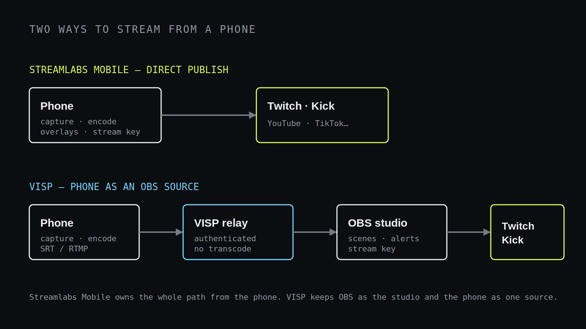

Streamlabs Mobile and VISP both start with a phone, but they end in very
different places. **Choose Streamlabs Mobile when the phone should be the whole
studio and broadcast straight to the platform. Choose VISP when the phone should
be one camera inside an OBS production that stays on your home computer.**

Neither tool is a universal replacement for the other. The right pick depends on
a single question: is the phone your entire show, or a source feeding a show you
already build in OBS?

## The short comparison

| Need | Streamlabs Mobile | VISP |
| --- | --- | --- |
| Go live directly from the phone | Core workflow | Not the goal; the phone feeds OBS |
| Keep an existing OBS studio as the output | Not its purpose | Core workflow |
| Overlays, alerts, and themes on the phone | Built in | Handled by OBS, not the phone |
| Where the Twitch/Kick stream key lives | On the phone | In OBS at home |
| Multistreaming to several platforms at once | Yes, with a paid Ultra plan | Whatever OBS is configured to send |
| Transport | RTMP (custom RTMP for many destinations) | SRT or RTMP into the relay, plus browser WebRTC |
| Repeat, revocable device credentials | Account login | Per-device publish access, independently revocable |
| Remote OBS control | Not applicable | Authenticated start/stop/scene through the VISP OBS plugin |
| Network bonding | No | No |

The last row matters for IRL work. Neither product bonds cellular and Wi-Fi into
one resilient uplink, and neither transcodes for you. If a single carrier
dropping must never interrupt the picture, that job belongs to a bonded encoder,
as covered in
[VISP vs BELABOX vs LiveU Solo](/blog/visp-vs-belabox-vs-liveu-solo).

## How Streamlabs Mobile works

[Streamlabs Mobile](https://streamlabs.com/mobile-app) is a self-contained
broadcasting app for iOS and Android. It is free to download, and it turns the
phone into the entire production: you set up scenes, alerts, overlays, and
widgets in the app, then go live directly to Twitch, Kick, YouTube, TikTok,
Facebook, and other destinations, including custom RTMP targets. Streamlabs
describes it as being able to "go live to Twitch, Kick, YouTube, TikTok,
Facebook, and more" right from the handset.

Two features shape that model. First, multistreaming: Streamlabs documents that
with a paid Ultra plan you can "stream to Twitch, YouTube, TikTok, Kick, and
more all at the same time." Second, Disconnect Protection, an Ultra feature that
shows a holding screen so, in Streamlabs' words, "even if your data drops, your
stream won't automatically end." Both live inside the app because the app is the
broadcaster.

That is a genuine strength when the phone is the show. A mobile-first creator who
wants overlays, alerts, and multiplatform output without a computer gets all of
it in one place, and the stream key stays managed by Streamlabs on the phone.

## How VISP works

VISP treats the phone as a publishing device, not a broadcaster. The
[native VISP app](https://docs.visp-stream.com/docs/phone-app) captures H.264
video and AAC audio and publishes over SRT to an authenticated relay path;
the browser publisher uses WebRTC, and third-party encoders such as Larix or
Moblin can publish over SRT or RTMP. OBS on the home computer then reads that
path as a media source, exactly like
[using a phone as a remote camera in OBS](/blog/use-phone-as-remote-camera-obs).

The important consequence is where the production lives. Your scenes, alerts,
graphics, recording, and the Twitch or Kick stream key stay in OBS at home. The
phone never receives the destination stream key. Each publishing device gets
independently revocable access, and the OBS read credential is separate from
publish access, so an old phone or a departed guest can be cut off without
touching your other cameras. Setup details are in the
[VISP get-started guide](https://docs.visp-stream.com/docs/get-started) and the
[video-source documentation](https://docs.visp-stream.com/docs/video-source).

VISP also lets the field operator control the studio. Through the paired OBS
plugin, an authenticated device can send start, stop, and scene commands over
outbound HTTPS, so OBS never exposes an inbound control port. See the
[OBS remote-control documentation](https://docs.visp-stream.com/docs/obs-remote-control)
for how that pairing works. VISP does not transcode the feed and does not bond
connections; the codec, resolution, and bitrate the phone sends are what reach
OBS.

## Where the two models genuinely differ

### Who owns the output

With Streamlabs Mobile, the phone owns the broadcast. If the phone is the only
device, the app handles overlays and delivery end to end. With VISP, OBS owns the
broadcast, and the phone is one input among your scenes, cameras, and audio
sources. If you have already invested in an OBS layout, alerts, and a produced
look, VISP preserves it; Streamlabs Mobile asks you to rebuild that look inside
the app.

### Multistreaming vs a single produced feed

Streamlabs Mobile's multistreaming sends the phone's output to several platforms
at once on a paid plan. VISP does not add its own multistreaming layer: it
delivers one clean contribution feed into OBS, and OBS decides where the finished
production goes. If simultaneous multiplatform output is the priority and the
phone is the studio, that is a point in Streamlabs Mobile's favor. If you want a
single, carefully produced feed with your existing overlays, the OBS path fits
better.

### Reliability during a network dip

Both models have honest limits on a bad connection. Streamlabs Mobile's
Disconnect Protection keeps the platform stream alive with a holding screen when
the phone's data drops. VISP moves that continuity to OBS: because the
destination broadcast runs on the home computer, OBS can hold a fallback scene,
local content, and audio while the phone reconnects, without ending the
platform stream. The
[mobile-network resilience guide](/blog/keep-stream-live-bad-mobile-network)
walks through configuring that fallback. Neither approach creates bandwidth where
none exists, and neither bonds two networks.

### One camera vs several

A single phone as the whole studio is Streamlabs Mobile's comfort zone. When you
need several independent cameras cut together, VISP gives each phone its own
device, credential, and OBS source, as shown in the
[multi-phone IRL guide](/blog/multi-phone-irl-stream-obs). Streamlabs Mobile is
built around the one phone in your hand, not a rack of contribution feeds landing
in a producer's OBS.

## Which should you choose?

Choose **Streamlabs Mobile** when:

- the phone is your entire studio and you do not want a separate computer;
- you want overlays, alerts, and themes managed inside the app;
- multistreaming to several platforms at once is a priority;
- a simple, self-contained mobile broadcast is the goal.

Choose **VISP** when:

- you already produce in OBS and want to keep those scenes, alerts, and stream key;
- a phone should behave like a named, revocable camera that returns each week;
- you want SRT contribution and latency tuning into an existing production;
- the field operator should control OBS without opening an inbound port;
- you need several phones as independent OBS sources rather than one broadcaster.

They can even coexist across shows: use Streamlabs Mobile for a quick solo
mobile stream, and VISP when the same phone needs to become a camera inside your
full OBS production. If your remote contributor is a two-way conversational guest
rather than a camera, compare the call-oriented option in
[VDO.Ninja vs VISP](/blog/vdo-ninja-vs-visp) as well.

## Frequently asked questions

### Does VISP replace Streamlabs Mobile?

Not for a phone-only broadcast. Streamlabs Mobile is built to be the whole studio
on the handset. VISP is built to make the phone a source inside an OBS production
that stays on your computer.

### Can Streamlabs Mobile feed OBS like VISP does?

That is not its main design. Streamlabs Mobile is oriented around publishing
directly to platforms from the phone, whereas VISP's entire purpose is delivering
an authenticated contribution feed into OBS.

### Does either one bond Wi-Fi and cellular?

No. Neither product combines multiple networks into one bonded uplink. Add a
bonded encoder if losing a single connection must not interrupt the feed.

### Where does the Twitch or Kick stream key live?

With Streamlabs Mobile it is managed on the phone. With VISP it stays only in OBS
at home, and the publishing phone never receives it.

### Do I have to rebuild my OBS setup to try VISP?

No. VISP adds the phone as a new media source, so your scenes, alerts, graphics,
and destination configuration stay exactly as they are.

## Sources and further reading

- [Streamlabs Mobile app overview](https://streamlabs.com/mobile-app)
- [Streamlabs Mobile live-streaming guide](https://support.streamlabs.com/hc/en-us/articles/4413175147931-Mobile-Live-Streaming-Guide)
- [Streamlabs multistreaming on mobile](https://streamlabs.com/multistream)
- [VISP: get started](https://docs.visp-stream.com/docs/get-started)
- [VISP: add a video source](https://docs.visp-stream.com/docs/video-source)
- [VISP: phone and browser publishing app](https://docs.visp-stream.com/docs/phone-app)
- [VISP: OBS remote control](https://docs.visp-stream.com/docs/obs-remote-control)

If you already build your show in OBS and want your phone to join it as a managed,
revocable camera instead of a standalone broadcaster,
[try VISP](https://visp-stream.com): add one device, read it into OBS as a media
source, and keep your scenes, alerts, and stream key exactly where they are.
